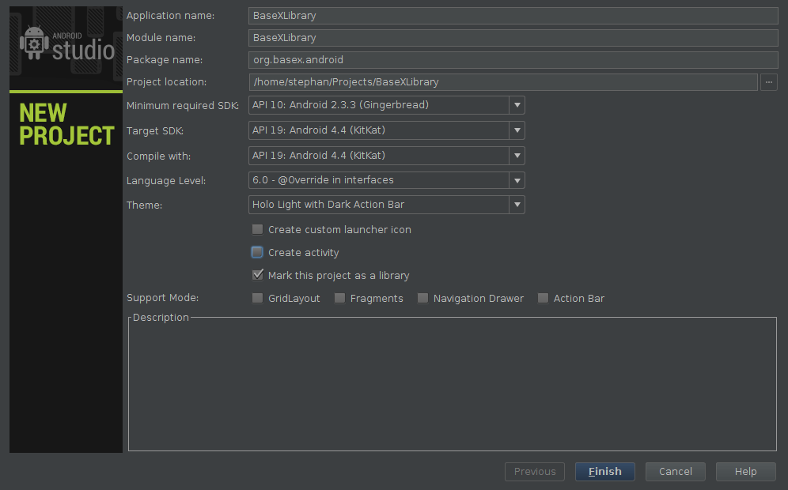
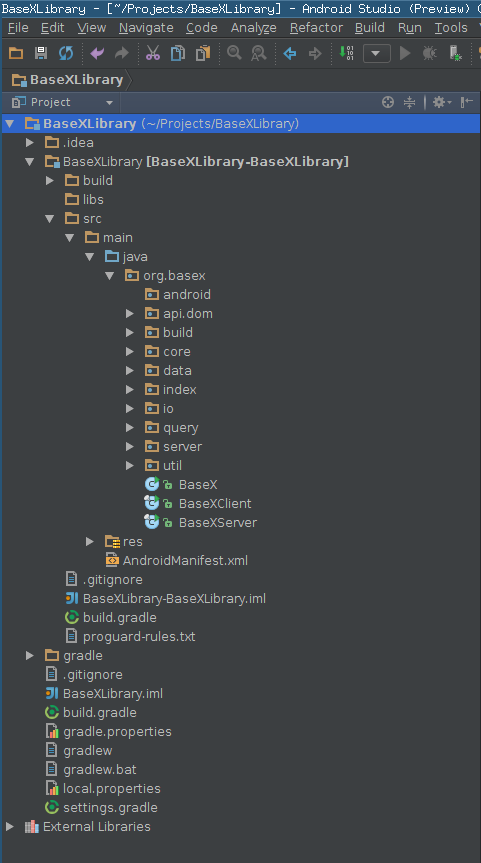

# Android
 

 
It is possible to create an Android port of BaseX. Therefore the present tutorial outlines the creation of a BaseX Android library, which can be used in any other application project. For the creation of the library the IDE Android Studio[[1]](http://developer.android.com/sdk/installing/studio.html) is used, but the steps are more or less equal using the Eclipse IDE. 

 
## Creating the Android Library Project 

The first step is to create an Android library project, which will be later modified to represent the BaseX Android library. In Android Studio the 'Create New Project' menu item needs to be chosen. In order to this the displayed window appears.  It is important that the minimum Android version is Gingerbread 2.3.3, because of some String methods used in BaseX which are not supported by Android versions older than Gingerbread. To create an Android library project, the 'Mark this project as library' item need to be checked. An Android library is not executable and therefore does not need the creation of an Activity, which is the reason why this item is unchecked in the picture above. After finishing the dialog Android Studio creates an empty library project with all needed folders and files. The next step is to copy the BaseX code into the created project folder 'src/main/java'. Except the package 'gui' and the Java file 'BaseXGui.java' inside the 'src.main.java.org.basex'[[2]](https://github.com/BaseXdb/basex/tree/master/basex-core/src/main/java/org/basex) package can be copied into the project folder. Android does not support Java AWT and Swing, which is the reason for not copying the gui package. 

### Adjusting the Code 

After successfully copying the corresponding BaseX packages and java files into the created Android library project a few adjustments have to be done in order to get a working Android library. At this moment the BaseX source code is presented in the Android library project as well as an empty android package, as it is shown in the following image.  In the empty android package a new Java class needs to be created, this class is used to create the necessary BaseX files and communicate with BaseX. This class needs the data directory of the application for storing the corresponding BaseX files. This files should be stored in the apps /data/data/.. folder which is only accessible from the application. This information is only available inside the applications context and not inside a library project, therefore it is necessary to pass this information to this class at the constructor call. The following source code shows a minimal example for a BaseX class. 

    public class BaseXDatabase {
    	private Context basexContext = null;
    	public BaseXDatabase(String data_dir) {
    		basexContext = new Context(data_dir);
    	}
    }

This class can be called in every Android application which uses the BaseX library with the following call, for example: 

    BaseXDatabase baseXDatabase = new BaseXDatabase(getApplicationInfo().dataDir);

At the moment it is not possible to use the BaseX library, therefore more adjustments have to be done in the BaseX code. First it is necessary to add an additional constructor to the Context class to create the BaseX files in the right directory and adjust the default constructor of it. The following code shows the changes inside the Context.java file: 

    public Context(String data_dir) {
    	this(true, (Prop.HOME = data_dir + "/"), (Prop.USERHOME = data_dir + "/"));	
    	File dir = new File(Prop.HOME + "BaseXData");
    	if(!dir.exists()) {
    		if(!dir.mkdir()) {
    			android.util.Log.i("BASEX", "CREATING BASEX DIRECTORIES");
    		}  
    	}
    }
    private Context(final boolean file, String home, String userhome) {
      this(new MainProp(file));
    }

As shown in the adjustment above, it is necessary to set the two variables 'Prop.HOME' and Prop.USERHOME' during the constructor call. In the BaseX code those variables are final, which need also be changed in order to set them during the call. The reason for this change is that the in BaseX used System.getProperty(user.dir) returns an empty string in Android[[3]](http://developer.android.com/reference/java/lang/System.html#getProperty(java.lang.String)). 

The next adjustment, which needs to be done, is to remove not supported packages inside the BaseX code. Therefore the package 'org.basex.query.util.crypto' need to be removed, because it uses external packages which are not supported by Android. The class which uses these files can be found inside the FNCrypto.java file in the 'query.func' package. This file needs to be deleted as well as its usage inside the Function.java file, which can also be found inside the 'query.func' package. The following lines need to be removed: 

      /** XQuery function. */
      _CRYPTO_HMAC(FNCrypto.class, "hmac(message,key,algorithm[,encoding])",
          arg(STR, STR, STR, STR_ZO), STR),
      /** XQuery function. */
      _CRYPTO_ENCRYPT(FNCrypto.class, "encrypt(input,encryption,key,algorithm)",
          arg(STR, STR, STR, STR), STR),
      /** XQuery function. */
      _CRYPTO_DECRYPT(FNCrypto.class, "decrypt(input,type,key,algorithm)",
          arg(STR, STR, STR, STR), STR),
      /** XQuery function. */
      _CRYPTO_GENERATE_SIGNATURE(FNCrypto.class, "generate-signature" +
          "(input,canonicalization,digest,signature,prefix,type[,item1][,item2])",
          arg(NOD, STR, STR, STR, STR, STR, ITEM_ZO, ITEM_ZO), NOD),
      /** XQuery function. */
      _CRYPTO_VALIDATE_SIGNATURE(FNCrypto.class, "validate-signature(node)", arg(NOD), BLN),
      URIS.put(FNCrypto.class, CRYPTOURI);

The result of this adjustment is, that it is now possible to use BaseX as an Android library, with the lack of support of the following XQuery functions: 

 * hmac(string,string,string[,string]) 
 * encrypt(string,string,string,string) 
 * decrypt(string,string,string,string) 
 * generate-signature(node,string,string,string,string,string[,item][,item]) 
 * validate-signature(node) 

### Using the BaseX Android Library 

To use the BaseX library the above created BaseXDatabase class can be extended with additional methods which are delegating requests to the BaseX database and return the results. An example of this can be seen in the following code: 

    public String executeXQuery(String query) throws IOException {
    	if(basexContext
    != null)
    		return new XQuery(query).execute(basexContext);
    	else
    		Log.e("BaseXDatabase", "No context");
    	return "";
    }

This methods of the BaseXDatabase class can now be used in every Android application which includes the created BaseX Android library. It is possible to create a .jar, or an .aar[[4]](http://tools.android.com/tech-docs/new-build-system/aar-format) file out of the BaseX library, by just building the source code. This file need to be copied inside the lib folder of the Android project which wants to use the library. Additionally the build file of the application needs to be adjusted to use the library. Using Gradle, the Android build system, it can be done by adding the following line to the gradle build file. This tells the build system that every library, inside the libs folder, is being compiled into the projects file. 

    dependencies {
        compile fileTree(dir: 'libs', include: ['*.jar', '*.aar'])
    }

