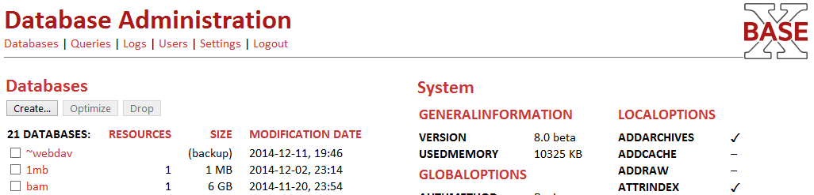

 

 
This page is part of the [Getting Started](Getting Started.md) Section. 

 
Since Version 8.0, the full distributions of BaseX are equipped with a simple browser-based database administration interface, the **DBA**. The browser frontend was completely written in [XQuery](XQuery.md) and [RESTXQ](RESTXQ.md). It allows you to create and administrate databases, evaluate queries in realtime, view log files and manage users. 

 
These were our design goals: 

  * The code base is supposed to help and motivate you developing your own RESTXQ web applications. 
 * The whole DBA code consumes only 100 KB. It uses very simple Javascript code that should run with nearly every browser. The interface is functional, but limited in terms of flashiness and interactivity. 
 * We tried to make the DBA features as self-explanatory as possible. All functionalities are also available via [Commands](Commands.md), [XQuery Modules](Module Library.md) or the Java [GUI](http://docs.basex.org/wiki/Graphical User Interface). 
 * The `dba` sub-directory can simply be copied and moved to any other place. All URL paths point to the same directory; it should be straightforward to adjust the RESTXQ path. 
 
Please be aware that it is an obvious **security risk** if you simply put DBA online along with your web page. At the very least, you should change the DBA path and the password of the `admin` user! 

 
The DBA has just been released, and it is in beta stage. We are looking forward to your reports and feature requests! Patches and extensions are even more welcome. 

 
# Startup
 * Download the **ZIP Archive** or the **Windows Installer** from the [download page](http://basex.org/download)
 * Start the [BaseX HTTP Server](.md)
 * Open a browser and visit the URL `http://localhost:8984/dba`

## First Steps

On the welcome page, you will need to authenticate yourself by entering a username and password. The default user is `admin`/`admin`. By specifying a host and port, you can communicate with a remote BaseX server instance. If you keep the field empty, you will be connected to the local BaseX instance. 

 The main page of the DBA interface contains a list of all databases on the left. On the right, the global and local options are listed, along with some system information. With the "Create…" button, a new database can be created. Existing database can be viewed, optimized, and dropped.  | DBA Main Page
------------------------------------------------------------------------------------------------------------------------------------------------------------------------------------------------------------------------------------------------------------------------------------------------ | ------------------------------------
 
# Changelog

Introduced with Version 8.0. 

