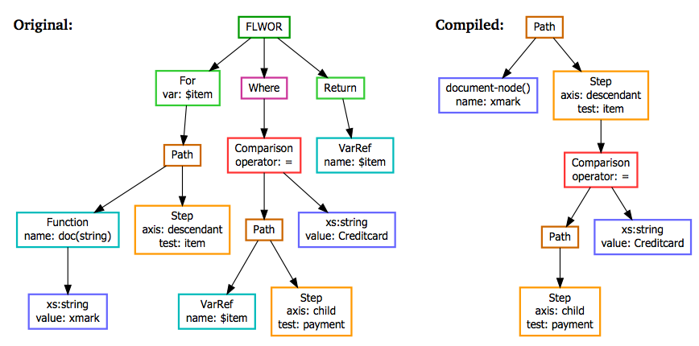
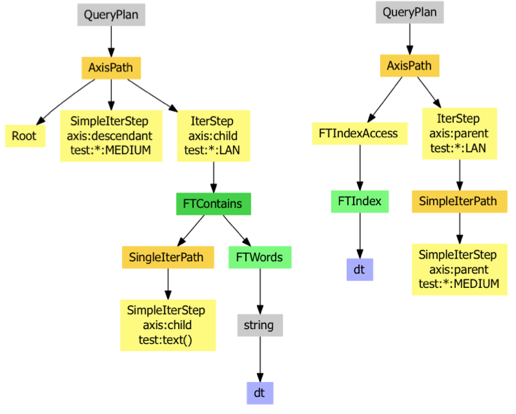

# Execution Plan
 

 
This article is part of the [Advanced User's Guide](Advanced User's Guide.md). For each execution of a query, BaseX creates an execution plan. This execution plan shows you each step of the query, so that you can evaluate your query and analyse if it accesses any [indexes](Indexes.md) or not. You can activate the execution plan by activating the `XMLPLAN` or `DOTPLAN` options. 

 
## Examples

### Execution plan for original and optimized query execution

Query: ` for $item in doc(’xmark’)/descendant::item where $item/payment = ’Creditcard’ return $item `

Optimized query: `doc(’xmark’)/descendant::item[payment = ’Creditcard’]`

Execution plan: 

Replacing XQuery with equivalent XPath expressionsUNKNOWN Query: `//MEDIUM/LAN[text() contains text "dt"]`

Execution plan: 

Query Plan 2

