# Git
 

 
This page is part of the [Developer Section](Developing.md). It describes how to use [git](http://git-scm.com/) to manage the BaseX sources. 

 
## Using Git to contribute to BaseX 

Our team uses git and [GitHub](https://github.com) to manage the source code. All team members have read+write access to the repository, and external contributors are welcome to fork the project. 

Git makes it easy to retain a full copy of the repository for yourself. To get started and running, simply _fork_ BaseX: 

1. Head over to [https://github.com](https://github.com) and create an account 
2. Fork [https://github.com/BaseXdb/basex](https://github.com/BaseXdb/basex), so you have a version on your own 
3. The forked project can then be cloned on your local machine, and changes can be pushed back to your remote repository 
4. Open Eclipse 
5. Install egit (Eclipse: _Help_ → _Marketplace_ → Search for _egit_**or** get it from [http://www.eclipse.org/egit/](http://www.eclipse.org/egit/)) 

### Using Git & Eclipse

To clone the project from within Eclipse, you may need to install EGit first (Eclipse: _Help_ → _Marketplace_ → Search for _egit_**or** get it from [http://www.eclipse.org/egit/](http://www.eclipse.org/egit/)). 

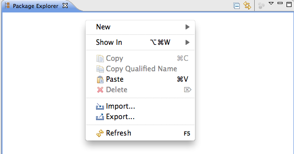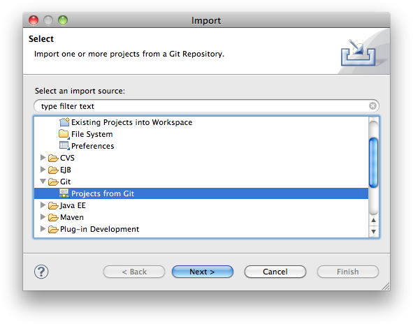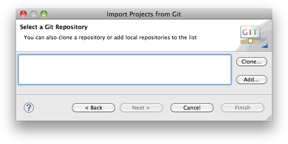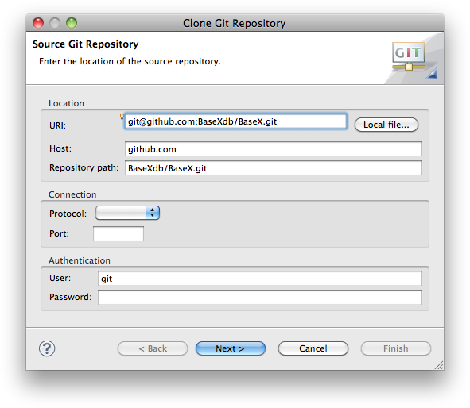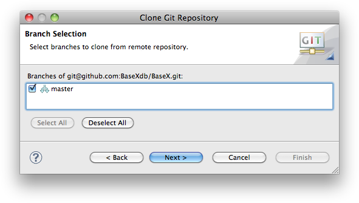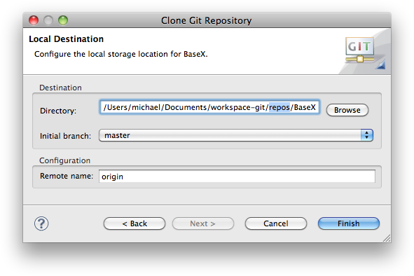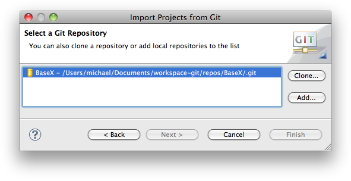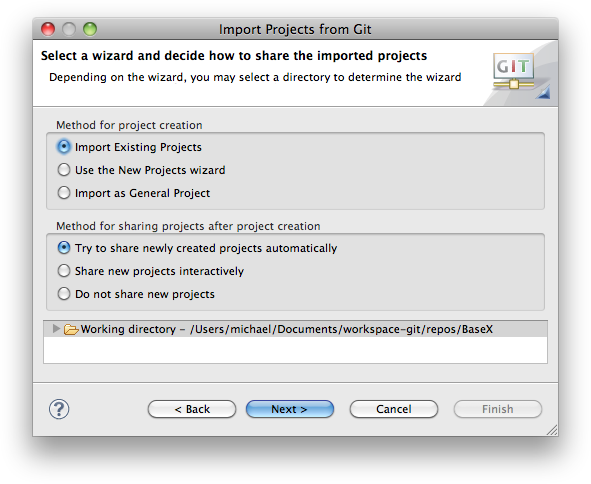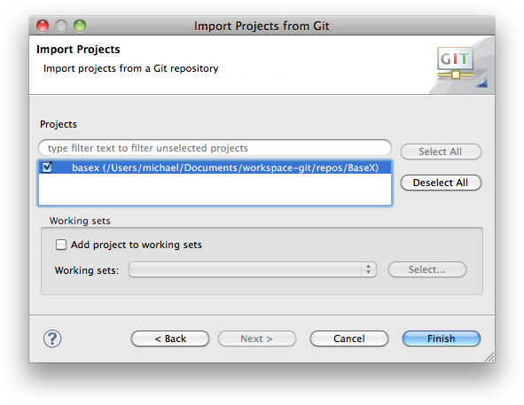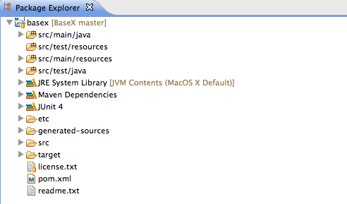 | UNKNOWN * In the **Package Explorer** to the left use right-click and choose Import... 
 * Select "**Projects from Git**" and click Next > 
 * Click "**Clone...**" to create a local copy of the remote repository. This copy will include the full project history 
 * Copy & Paste the GitHub URI in the Location field. If you want to use SSH make sure you provided GitHub with your public key to allow write-access. If in doubt use the HTTPS URI and authenticate yourself with your GitHub credentials. The read-only URI of the repository is `https://github.com/BaseXdb/basex.git`. 
 * Select the master branch (or arbitrary branches you like) 
 * Now choose a location where the local repository is stored: Create <workspace>**/repos/BaseX** and click "**Finish**". 
UNKNOWN * Select our newly cloned repository and click Next 
 * Select "**Import Existing Projects**" and depending on your Eclipse version enable automatic sharing. More recent versions will not offer this feature as sharing is enabled by default. 
 * Click next to select the Project to import 
 * Check "basex" to checkout and click finish 
 * You are now ready to contribute. 
UNKNOWN EGit uses the [JSch](http://www.jcraft.com/jsch) library which is, however, [reported](https://bugs.eclipse.org/bugs/show_bug.cgi?id=326526) to have problems with RSA SSH keys in linux and possibly other platforms. A solution would be to use the variable GIT_SSH and assign it a path to the native SSH executable. According to [this](http://egit.eclipse.org/r/#change,2037) change in EGit, the plugin will try to use a native SSH implementation instead of JSch (this, however, may not always work either :( ). **Note**: this is not intended to be a complete git reference; it's purpose is to quickly introduce BaseX developers to the most commonly used git commands in the context of the BaseX project. Note that git automatically creates a directory where the repository content will be checked out. Currently, there is only one remote repository; it is automatically registered during the clone operation. Git remembers this repository as the default repository for push/pull operations. After some files have been changed locally, the changes can be seen as follows: **Note**: this commit operation does **not** commit into the remote repository! First, it is needed to select the modified files which should be committed: Then perform the actual commit: Before executing the actual commit, git will open the default shell editor (determined using the $EDITOR variable, usually vi) to enter a message describing the commit changes. Alternative way is to commit all changed files, i. e. it is not needed to explicitly add the changed files: The upstream repository is the one from which the BaseX releases are made and the one from which the personal repository was forked. When some changes are made in the upstream repository, they can be pulled to the local repository as follows: The changes can then be pushed in the personal repository: Check out the links at the end of the page for more git options. 
------------------------------------------------------------------------------------------------------------------------------------------------------------------------------------------------------------------------------------------------------------------------------ | ---------------------------------------------------------------------------------------------------------------------------------------------------------------------------------------------------------------------------------------------------------------------------------------------------------------------------------------------------------------------------------------------------------------------------------------------------------------------------------------------------------------------------------------------------------------------------------------------------------------------------------------------------------------------------------------------------------------------------------------------------------------------------------------------------------------------------------------------------------------------------------------------------------------------------------------------------------------------------------------------------------------------------------------------------------------------------------------------------------------------------------------------------------------------------------------------------------------------------------------------------------------------------------------------------------------------------------------------------------------------------------------------------------------------------------------------------------------------------------------------------------------------------------------------------------------------------------------------------------------------------------------------------------------------------------------------------------------------------------------------------------------------------------------------------------------------------------------------------------------------------------------------------------------------------------------------------------------------------------------------------------------------------------------------------------------------------------------------------------------------------------------------------------------------------------------------------------------------------------------------------------------------------------------------------------------------------------------------------------------------------------------------------------------------------------------------------------------------------------------------------------------------------------------------------------------------------------------------------------------------------------------------------------------------------------------------------------------------------------------------------------------------------------------------------------------------------------------------------------------------------------------------------------------------------------------------------------------------------------------------------------------------------------------------------------------------------------------------------------------------------------------------------------------------------------------

#### Developing a new feature or bug fix using git

It is always a good idea to create a new branch for a new feature or a big fix you are working on. So first, let's make sure you have the most up-to-date source code. We assume, that you added BaseX as upstream repository as described above and you are currently in the _master_ branch: 

    $ git pull upstream master

Now, we create a new branch, based on the master branch 

    $ git checkout -b new-feature
    Switched to a new branch 'new-feature'

Your are now automatically switched to the _new-feature_ branch. Now you can make all your changes in one or several commits. You can commit all changes using 

    $ git commit -a

Now, you want to push these changes to the repository on GitHub. Remember, that up to now your changes just reside on your local drive, so now you want to push it to your remote fork of BaseX. Simply do: 

    $ git push origin new-featuCounting objects: 318, done.
    Delta compression using up to 4 threads.
    Compressing objects: 100% (107/107), done.
    Writing objects: 100% (154/154), 22.96 KiB | 0 bytes/s, done.
    Total 154 (delta 93), reused 81 (delta 26)
    To git@github.com:$username/basex.git
     * [new branch]      new-feature -> new-featurere

You can now use your web browser and go to your fork of BaseX. You will see the following message: 

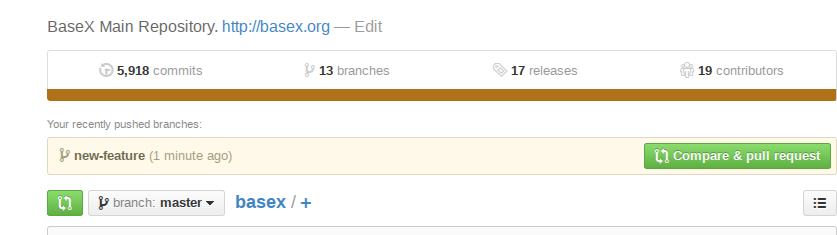

You can now click the "Compare & pull request" button. You can now review the changes you are going to push. 

**Please review them carefully. Also, please give a meaningful comment so we can quickly determine what your changes are doing.** After clicking the "Create Pull request" button you are done and we will review your changes and either merge the pull request or get back to you. 

### Need help using git?

#### Installing

For information on how to install git on various platforms please refer to: [GitHub: git Installation Guide](http://help.github.com/git-installation-redirect/)

#### Documentation
 * [Comprehensive Getting Starting Guide on GitHub](http://help.github.com/)
 * [The git book](http://book.git-scm.com/index.html)
 * [Gitcasts.com – Video Guides](http://gitcasts.com/)
