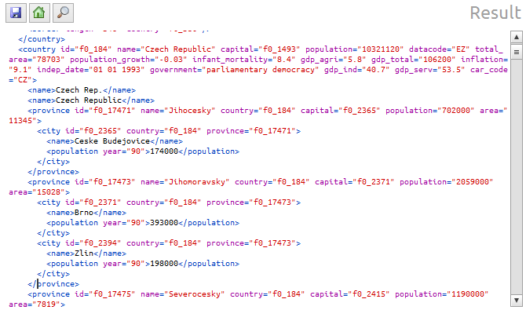
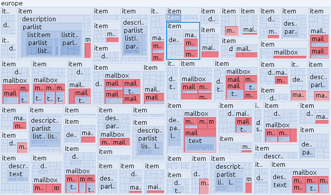
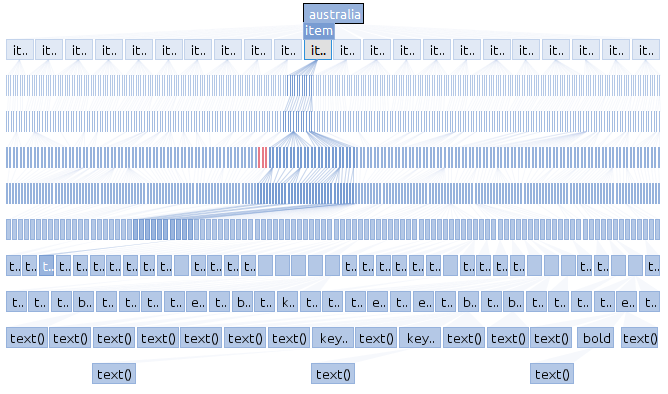
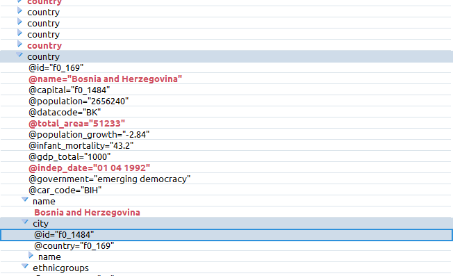
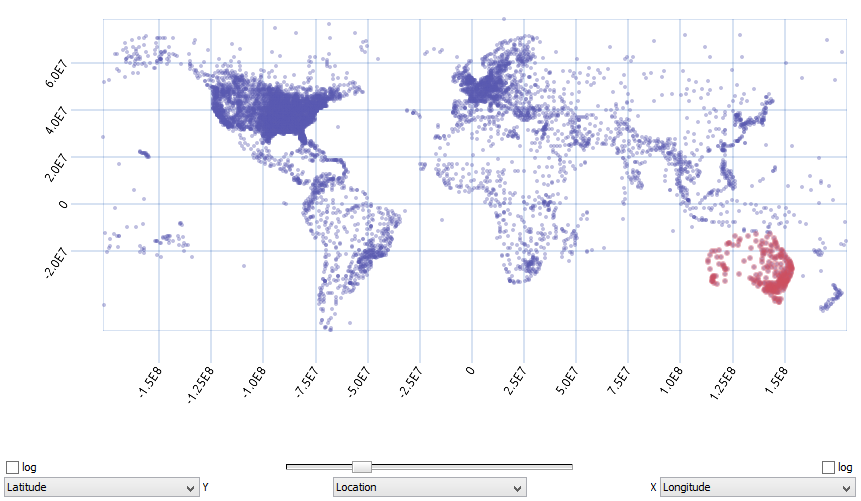
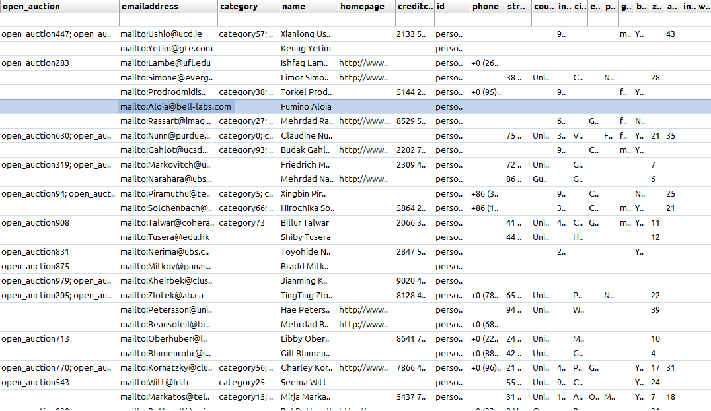
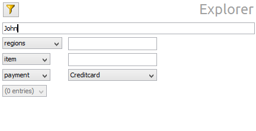
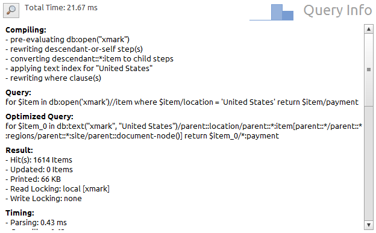
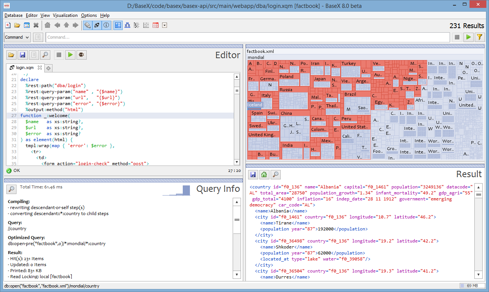
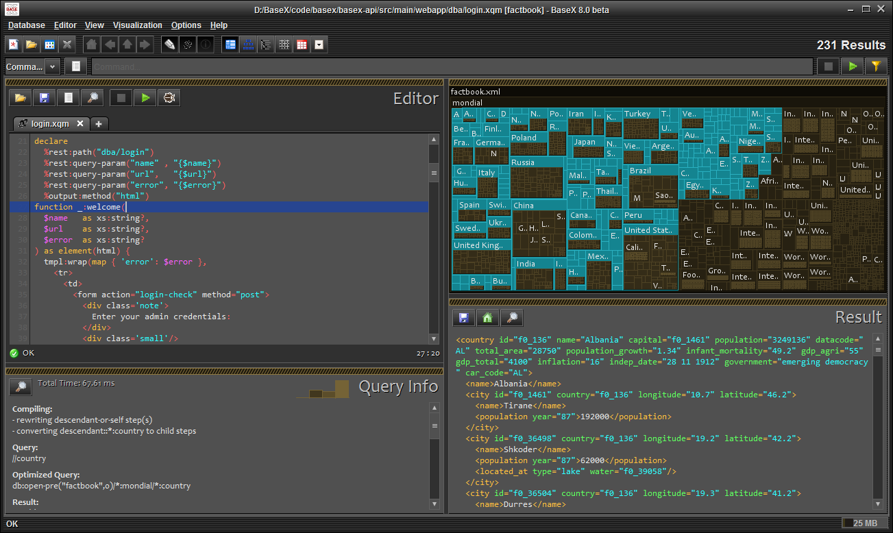

# Graphical User Interface
 

 
This page is part of the [Getting Started](Getting Started.md) Section. The BaseX homepage gives you a [visual impression](http://basex.org/products/gui) of the graphical user interface (GUI) of BaseX, and an [introductory video](http://www.youtube.com/watch?v=xILHKGPGaJ4&hd=1) is available, which presents some of its interactive features. 

 
## Startup

First of all, launch a GUI instance of BaseX. Depending on your operating system, double click on the **BaseX GUI** start icon or run the `basexgui` script. Beside that, some more [startup options](Startup.md#StartupBaseX_GUI) are available. 

### Create Database

Select _Database_ → _New_ and browse to an XML document of your choice. As an example, you can start with the `factbook.xml` document, which contains statistical information on the worlds' countries. It is included in our official releases and can also be [downloaded](http://files.basex.org/xml/factbook.xml) (1.3 MB). If you type nothing in the input field, an empty database will be created. Next, choose the _OK_ button, and BaseX will create a database that you can visually explore and query. 

If no XML document is available, the [Text Editor](Graphical User Interface.md#Text_Editor) can also be used to create an initial XML document. After saving the entered XML document to harddisk, it can be specified in the above dialog. 

### Realtime Options

Via the _Options_ menu, you can change how queries are executed and visualized: 

 * **Realtime Execution** : If realtime execution is enabled, your searches and queries will be executed with each key click and the results will be instantly shown. 
 * **Realtime Filtering** : If enabled, all visualizations will be limited to the actual results in realtime. If this feature is disabled, the query results are highlighted in the visualizations and can be explicitly filtered with the 'Filter' button. 

### Querying

#### Keyword Search

The Keyword Search can be executed in the **Search** mode in the combo box of the main window. This options allows for a simple, keyword-based search in the opened database. 

The following syntax is supported: 

**Query ** | **Description **
---------- | ----------------
`world` | Find tags and texts containing `world`
`=world` | Find exact matching text nodes 
`~world` | Find text nodes similar to `world`
`@world` | Find attributes and attribute values 
`@=world` | Find exact attribute values 
`"united world"` | Find tags and texts containing the phrase `"united world"`

#### XPath/XQuery

Apart from the basic search facilities, BaseX offers far more sophisticated processing options to query your documents. Below are some examples you might give a try. This guide is far from being a comprehensive XQuery reference, but might point you in the right direction. 

To execute the following queries, enter them in the XQuery Panel and press ENTER or click on the START button. 

XPath provides an easy facility to query your documents in a navigational manner. It is the basic tool of all node-related operations that you encounter when using XQuery. We will start with a trivial example and extend it to our needs. 

** Example: Find Countries **

    //country

tells BaseX to look for all `country` elements in the document. The query is introduced by two slashes `//`, which trigger the traversal of all document nodes. The queries `//country` andd `/descendant::country` will return the same results. 

** Example: Find Cities in Switzerland **

The following query uses a **predicate**`[...]` to filter all `country` nodes which have a `name` child, the string value of which is "Switzerland": 

    //country[name = "Switzerland"]

To return all cities of the resulting element node, the query can be extended by a trailing `//city` path: 

    //country[name = "Switzerland"]//city

#### Text Editor

The text editor can be used to type in [XQuery](XQuery.md) expressions, [Command Scripts](Commands.md#Basics), XML documents, or any other text files. Query files and XML documents can be started by clicking on the green triangle. They will automatically parsed with each key click, and errors will be highlighted. Various [keyboard shortcuts](Shortcuts.md) are available to speed up editing and debugging. 

### Visualizations

The BaseX GUI offers various visualizations, which help you to explore your XML data instances from different perspectives: 

Text View **Result** | Map View **Map**
------------------------------------------------- | ---------------------------------------
Tree View **Tree** | Folder View **Folder**
Scatterplot View **Plot** | The Table View **Table**
Explorer View **Explorer** | Info View **Info**

### Look and Feels

 By default, the Look and Feel of your operating system will be used in the GUI. In the _Preferences_ dialog, you can choose among some more window themes. The [JTattoo library](http://www.jtattoo.net/ScreenShots.html) offers some more look and feels. If you download and copy the JTattoo jar file into the `lib` directory provided by the ZIP and EXE distribution of BaseX, 13 additional looks and feels will get available. This feature is available since Version 8.0.  | Default Look & Feel | HiFi Look & Feel
------------------------------------------------------------------------------------------------------------------------------------------------------------------------------------------------------------------------------------------------------------------------------------------------------------------------------------------------------------------------------------------------------------------------------------------------------------------------------------- | -------------------------------------------------------- | -----------------------------------------------
