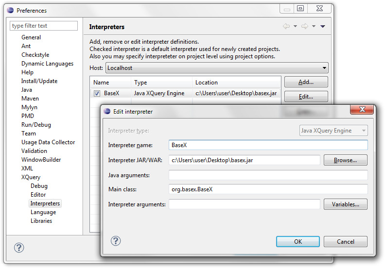

# Integrating Eclipse
 

 
This article is part of the [Getting Started](Getting Started.md) Section. It describes how to run XPath/XQuery code from within the [Eclipse IDE](http://www.eclipse.org). 

 
Another article describes how to [compile and run](Developing with Eclipse.md) BaseX with Eclipse. 

 
## Installation

The following steps apply to all operating systems: 

 * Install Version 3.7 (Indigo) of Eclipse: [http://www.eclipse.org](http://www.eclipse.org). Please note that more recent versions may work as well, but haven’t been tested so far. 
 * download your favorite BaseX distribution (JAR, ZIP, EXE): [http://basex.org/download/](http://basex.org/download/)

### Windows

It should be sufficient to install the official XQuery Development Tools Plugin (XQDT): [http://www.xqdt.org/](http://www.xqdt.org/)Update Site: [http://download.eclipse.org/webtools/incubator/repository/xquery/milestones/](http://download.eclipse.org/webtools/incubator/repository/xquery/milestones/)

### Linux
 * First, install the [Dynamic Languages Toolkit](http://www.eclipse.org/dltk/install.php) (DLTK)Update Site: [http://download.eclipse.org/releases/indigo/](http://download.eclipse.org/releases/indigo/)
 * Next, install [Marklogic’s XQDT Dropin](http://developer.marklogic.com/learn/xqdt-setup#nf53b95195b77b227)

### Mac OSX
 * Install [Marklogic’s XQDT Dropin](http://developer.marklogic.com/learn/xqdt-setup#nf53b95195b77b227)

### Setting up

Use BaseX as query processor in Eclipse You can set up the XQuery interpreter as standalone or client version, as shown on the screenshot: 

#### Setting up as Standalone
1. Start Eclipse and go to _Preferences_ → _XQuery_ → _Interpreters_. 
2. Add a new Interpreter with the _Add_ button. 
3. Enter "BaseX" as name and choose "Java XQuery Engine" as Interpreter type. 
4. Point _Interpreter JAR/WAR_ to the BaseX JAR archive 
5. Choose `org.basex.BaseX` as _Main class_

#### Setting up as Client
1. Start Eclipse and go to _Preferences_ → _XQuery_ → _Interpreters_. 
2. Add a new Interpreter with the _Add_ button. 
3. Enter "BaseX" as name and choose "Java XQuery Engine" as Interpreter type. 
4. Point _Interpreter JAR/WAR_ to the BaseX JAR archive 
5. Choose `org.basex.BaseXClient` as _Main class_
6. Set interpreter arguments for your server, port, username and password, e.g. `-Uadmin -Padmin -nlocalhost -p1984`. 

### Usage

The query execution works as follows:

1. Create a new XQuery Project with _File_ → _New_ → _XQuery Project_. 
2. Add a new XQuery Module with _File_ → _New_ → _XQuery Module_. 
3. Edit your XQuery Module and execute it with _Run_. 
4. The results are displayed in the Console window of Eclipse. 
