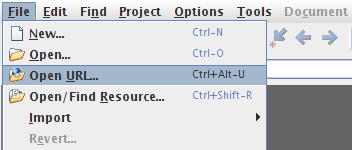
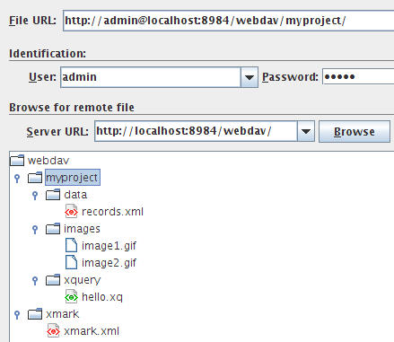

# Integrating oXygen
 

 
This tutorial is part of the [Getting Started](Getting Started.md) Section. It describes how to access BaseX from the [oXygen XML Editor](http://www.oxygenxml.com). Currently, there are two variants how to use BaseX in oXygen: 

  * Resources in [databases](Databases.md) can be opened and modified. 
 * XPath/XQuery expressions can be run by the [query processor](XQuery.md) of BaseX. 
 
## Access Database Resources

### Preparations
 * First, start the BaseX [WebDAV](WebDAV.md) service. 

### Configuration
1. Go to menu _Options_ → _Preferences_ → _Data Sources_
2. In the Connections panel, click the _New_ button (`+`) 
3. Enter "BaseX-WebDAV" as connection name 
4. Select "WebDAV" in the Data Source combo box 
5. Fill in the appropriate connection details. Below, the default values are shown: 
6. Now press _OK_, and your Data Source is ready for use 

You can now open single database files as follows: 

 * Choose _File_ → _Open URL..._. 

 * Enter the corresponding user name and password (if needed), the URL of the BaseX WebDAV Server, and then click "Browse". 

### Perform Queries

#### Preparations
1. Download one of the complete [BaseX distributions](http://basex.org/download) (ZIP, EXE) 
2. Charles Foster's XQJ implementation provides a default (client/server) and a local driver. If you want to use the first flavor, you need to start a [BaseX Server](Startup.md#StartupBaseX_Server) instance 

#### Data Source
1. Start oXygen and go to _Options_ → _Preferences_ → _Data Sources_
2. Add a new Data Source with the _New_ button (`+`) 
3. Enter "BaseX-XQJ" as connection name and choose _XQuery API for Java (XQJ)_ as type 
4. Add the following JAR files above with the _Add_ Button: `xqj-api-1.0.jar`, `xqj2-0.2.0.jar` and `basex-xqj-1.3.0.jar` (the versions of the JAR file may differ). If you add the BaseX library as well `basex7.9.jar`, you can also use the local XQJ driver. 
5. Unter "Driver class", choose the default or the local XQJ driver (`net.xqj.basex.BaseXXQDataSource` vs. `net.xqj.basex.local.BaseXXQDataSource`). 
6. Press _OK_

#### Connection
1. Press _New_ (`+`) in the Connection Panel below. 
2. Enter Name "BaseX" and select "BaseX-XQJ" in the Data Source box. 
3. If you use the default driver, you need to enter connection details: 
4. Now press _OK_, and your connection is ready. 

#### Usage

The query execution works as follows: 

1. Configure a new transformation scenario in _Window_ → _Show View_ → _Transformation Scenarios_. 
2. Choose the _XQuery Transformation_ tree entry. 
3. Press the `plus` sign to add a new scenario. 
4. Enter a Name and an optional XML and XQuery URL (e.g. your query document/file). 
5. Choose "BaseX" as Transformer from the combo box. 
6. Press _OK_, and your scenario is ready. Now you can start the transformation, e.g. by clicking on the red _Play_ button. 
7. The results should immediately occur in the result panel. 

--[CG](http://docs.basex.org/wiki/User:CG) 14:45, 29 January 2015 (CET) 

