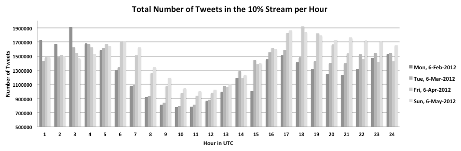
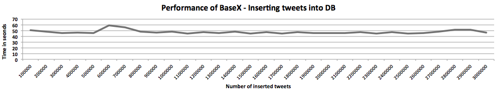

 

 
This article is part of the [Advanced User's Guide](Advanced User's Guide.md). It is about the usage of BaseX for processing and storing the live data stream of Twitter. We illustrate some statistics about the Twitter data and the performance of BaseX. 

 
As [Twitter](http://twitter.com) attracts more and more users (over 140 million active users in 2012) and is generating large amounts of data (over 340 millions of short messages ('tweets') daily), it became a really exciting data source for all kind of analytics. Twitter provides the developer community with a set of [APIs](https://dev.twitter.com/start) for retrieving the data about its users and their communication, including the [Streaming API](https://dev.twitter.com/docs/streaming-apis) for data-intensive applications, the [Search API](https://dev.twitter.com/docs/using-search) for querying and filtering the messaging content, and the [REST API](https://dev.twitter.com/docs/api) for accessing the core primitives of the Twitter platform. 

 
# BaseX as Twitter Storage

For retrieving the Twitter stream we connect with the Streaming API to the endpoint of Twitter and receive a never ending tweet stream. As Twitter delivers the tweets as [JSON](http://www.json.org/) objects the objects has to be converted into XML fragments. For this purpose the parse function of the [XQuery JSON Module](JSON Module.md) is used. In the examples section both versions are shown ([tweet as JSON](Twitter.md#Example_Tweet_.28JSON.29) and [tweet as XML](Twitter.md#Example_Tweet_.28XML.29)). For storing the tweets including the meta-data, we use the standard _insert_ function of [XQuery Update](http://docs.basex.org/wiki/XQuery Update). 

 
# Twitter’s Streaming Data

Each tweet object in the data stream contains the tweet message itself and over 60 data fields (for further information see the [fields description](https://dev.twitter.com/docs/platform-objects)). The following section shows the amount of data, that is delivered by the Twitter Streaming API to the connected endpoints with the 10% gardenhose access per hour on the 6th of the months February, March, April and May. It is the pure public live stream without any filtering applied. 

## Statistics

** Day ** | ** Description ** | ** Amount **
--------- | ----------------- | ------------
 Mon, 6-Feb-2012  |  Total tweets  |  30.824.976 
 |  Average tweets per hour  |  1.284.374 
 |  Average tweets per minute  |  21.406 
 |  Average tweets per second  |  356 
 Tue, 6-Mar-2012  |  Total tweets  |  31.823.776 
 |  Average tweets per hour  |  1.325.990 
 |  Average tweets per minute  |  22.099 
 |  Average tweets per second  |  368 
 Fri, 6-Apr-2012  |  Total tweets  |  34.638.976 
 |  Average tweets per hour  |  1.443.290 
 |  Average tweets per minute  |  24.054 
 |  Average tweets per second  |  400 
 Sun, 6-May-2012  |  Total tweets  |  35.982.976 
 |  Average tweets per hour  |  1.499.290 
 |  Average tweets per minute  |  24.988 
 |  Average tweets per second  |  416 

## Example Tweet (JSON)

    {
      "contributors": null,
      "text": "Using BaseX for storing the Twitter Stream",
      "geo": null,
      "retweeted": false,
      "in_reply_to_screen_name": null,
      "possibly_sensitive": false,
      "truncated": false,
      "entities": {
        "urls": [
        ],
        "hashtags": [
        ],
        "user_mentions": [
        ]
      },
      "in_reply_to_status_id_str": null,
      "id": 1984009055807*****,
      "in_reply_to_user_id_str": null,
      "source": "<a href=\"http:\/\/twitterfeed.com\" rel=\"nofollow\">twitterfeed<\/a>",
      "favorited": false,
      "in_reply_to_status_id": null,
      "retweet_count": 0,
      "created_at": "Fri May 04 13:17:16 +0000 2012",
      "in_reply_to_user_id": null,
      "possibly_sensitive_editable": true,
      "id_str": "1984009055807*****",
      "place": null,
      "user": {
        "location": "",
        "default_profile": true,
        "statuses_count": 9096,
        "profile_background_tile": false,
        "lang": "en",
        "profile_link_color": "0084B4",
        "id": 5024566**,
        "following": null,
        "protected": false,
        "favourites_count": 0,
        "profile_text_color": "333333",
        "contributors_enabled": false,
        "verified": false,
        "description": "http:\/\/basex.org",
        "profile_sidebar_border_color": "C0DEED",
        "name": "BaseX",
        "profile_background_color": "C0DEED",
        "created_at": "Sat Feb 25 04:05:30 +0000 2012",
        "default_profile_image": true,
        "followers_count": 860,
        "geo_enabled": false,
        "profile_image_url_https": "https:\/\/si0.twimg.com\/sticky\/default_profile_images\/default_profile_0_normal.png",
        "profile_background_image_url": "http:\/\/a0.twimg.com\/images\/themes\/theme1\/bg.png",
        "profile_background_image_url_https": "https:\/\/si0.twimg.com\/images\/themes\/theme1\/bg.png",
        "follow_request_sent": null,
        "url": "http:\/\/adf.ly\/5ktAf",
        "utc_offset": null,
        "time_zone": null,
        "notifications": null,
        "friends_count": 2004,
        "profile_use_background_image": true,
        "profile_sidebar_fill_color": "DDEEF6",
        "screen_name": "BaseX",
        "id_str": "5024566**",
        "show_all_inline_media": false,
        "profile_image_url": "http:\/\/a0.twimg.com\/sticky\/default_profile_images\/default_profile_0_normal.png",
        "is_translator": false,
        "listed_count": 0
      },
      "coordinates": null
    }

## Example Tweet (XML)

    <json booleans="retweeted possibly__sensitive truncated favorited possibly__sensitive__editable default__profile profile__background__tile protected contributors__enabled verified default__profile__image geo__enabled profile__use__background__image show__all__inline__media is__translator" 
      numbers="id retweet__count statuses__count favourites__count followers__count friends__count listed__count"
      nulls="contributors geo in__reply__to__screen__name in__reply__to__status__id__str in__reply__to__user__id__str in__reply__to__status__id in__reply__to__user__id place following follow__request__sent utc__offset time__zone notifications coordinates" 
      arrays="urls indices hashtags user__mentions"
      objects="json entities user">
      <contributors/>
      <text>Using BaseX for storing the Twitter Stream</text>
      <geo/>
      <retweeted>false</retweeted>
      <in__reply__to__screen__name/>
      <possibly__sensitive>false</possibly__sensitive>
      <truncated>false</truncated>
      <entities>
        <urls/>
        <hashtags/>
        <user__mentions/>
      </entities>
      <in__reply__to__status__id__str/>
      <id>1984009055807*****</id>
      <in__reply__to__user__id__str/>
      <source><a href="http://twitterfeed.com" rel="nofollow">twitterfeed</a></source>
      <favorited>false</favorited>
      <in__reply__to__status__id/>
      <retweet__count>0</retweet__count>
      <created__at>Fri May 04 13:17:16 +0000 2012</created__at>
      <in__reply__to__user__id/>
      <possibly__sensitive__editable>true</possibly__sensitive__editable>
      <id__str>1984009055807*****</id__str>
      <place/>
      <user>
        <location/>
        <default__profile>true</default__profile>
        <statuses__count>9096</statuses__count>
        <profile__background__tile>false</profile__background__tile>
        <lang>en</lang>
        <profile__link__color>0084B4</profile__link__color>
        <id>5024566**</id>
        <following/>
        <protected>false</protected>
        <favourites__count>0</favourites__count>
        <profile__text__color>333333</profile__text__color>
        <contributors__enabled>false</contributors__enabled>
        <verified>false</verified>
        <description>http://basex.org</description>
        <profile__sidebar__border__color>C0DEED</profile__sidebar__border__color>
        <name>BaseX</name>
        <profile__background__color>C0DEED</profile__background__color>
        <created__at>Sat Feb 25 04:05:30 +0000 2012</created__at>
        <default__profile__image>true</default__profile__image>
        <followers__count>860</followers__count>
        <geo__enabled>false</geo__enabled>
        <profile__image__url__https>https://si0.twimg.com/sticky/default_profile_images/default_profile_0_normal.png</profile__image__url__https>
        <profile__background__image__url>http://a0.twimg.com/images/themes/theme1/bg.png</profile__background__image__url>
        <profile__background__image__url__https>https://si0.twimg.com/images/themes/theme1/bg.png</profile__background__image__url__https>
        <follow__request__sent/>
        <url>http://adf.ly/5ktAf</url>
        <utc__offset/>
        <time__zone/>
        <notifications/>
        <friends__count>2004</friends__count>
        <profile__use__background__image>true</profile__use__background__image>
        <profile__sidebar__fill__color>DDEEF6</profile__sidebar__fill__color>
        <screen__name>BaseX</screen__name>
        <id__str>5024566**</id__str>
        <show__all__inline__media>false</show__all__inline__media>
        <profile__image__url>http://a0.twimg.com/sticky/default_profile_images/default_profile_0_normal.png</profile__image__url>
        <is__translator>false</is__translator>
        <listed__count>0</listed__count>
      </user>
      <coordinates/>
    </json>

 
# BaseX Performance 

The test show the time BaseX needs to insert large amounts of real tweets into a database. We can derive that BaseX scales very well and can keep up with the incoming amount of tweets in the stream. Some lower values can occur, cause the size of the tweets differ according to the meta-data contained in the tweet object. Note: The `AUTOFLUSH` option is set to `FALSE` (default: `SET AUTOFLUSH TRUE`) 

System Setup: Mac OS X 10.6.8, 3.2 GHz Intel Core i3, 8 GB 1333 MHz DDR3 RAM BaseX Version: BaseX 7.3 beta 

## Insert with XQuery Update 

These tests show the performance of BaseX performing inserts with XQuery Update as single updates per tweet or bulk updates with different amount of tweets. The initial database just contained a root node `<tweets/>` and all incoming tweets are inserted after converting from JSON to XML into the root node. The time needed for the inserts includes the conversion time. 

### Single Updates 

** Amount of tweets ** | ** Time in seconds ** | ** Time in minutes ** | ** Database Size (without indexes) **
---------------------- | --------------------- | --------------------- | -------------------------------------
 1.000.000  |  492.26346  |  8.2  |  3396 MB 
 2.000.000  |  461.87326  |  7.6  |  6997 MB 
 3.000.000  |  470.7054  |  7.8  |  10452 MB 

