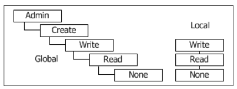

 

 
This article is part of the [Advanced User's Guide](Advanced User's Guide.md). The user management defines which permissions are required by a user to perform a database command or XQuery expression. 

 
Permissions are mostly relevant in the client/server architecture, as the [Standalone Mode](Standalone Mode.md) and the [GUI](http://docs.basex.org/wiki/Graphical User Interface) is run with admin permissions. There are a few exceptions such as the [xquery:eval](XQuery Module.md#xqueryeval) function: its execution scope can also be limited by specifying a permission. 

 
With Version 8.0, the user management has been revised: 

  * Permissions can now be **manually edited**, as they are stored as XML. 
 * The permission file has been moved from the home directory to the **database directory**. It was renamed from `.basexperm` to `users.xml`. 
 * Local permissions are now defined for database **glob patterns** instead of single databases. Both local and global permissions are stored in the same file. 
 * A new [User Module](User Module.md) is available, which allows user management via **XQuery**. 
 * MD5 password hashing has been discarded, as many md5 hashes can be easily uncovered with rainbow tables. 
 * **Salted sha256**  hashes are now used for authentication (the current timestamp will be used as salt). 
 * Additionally, **digest** hashes are used in the client/server architecture and the [Language Bindings](Clients.md), and in the [HTTP Context](Web Application.md) if the [AUTHMETHOD](Options.md#authmethod) is set to `Digest`. 
 
Warning: As the available md5 hashes cannot automatically be converted to the new format, existing credentials will be ignored, and you will need to recreate your user data. Moreover, we will incrementally provide new [Language Bindings](Clients.md), which will be based on the digest hashes. 

 
Passwords in commands and XQuery functions are now specified in **plain text**. The rationale behind this is: 

  * Transmission of passwords as md5 has not been safe anyway, as indicated above. 
 * Different hash values can now be created from the original password. 
 
You will be safe if you follow basic security measures: ensure that your password will not end up in your bash history, avoid sending passwords via ordinary REST requests, etc. 

 
# Rules

In the permission hierarchy below, the existing permissions are illustrated. A higher permission includes all lower permissions. For example, all users who have the `write` permission assigned will also be able to execute commands requiring `read` permission. 

Local permissions are applied to databases. They have a higher precedence and override global permissions. 

Permissions hierarchy User names must follow the [valid names constraints](Commands.md#validnames), and the database patterns must follow the [Glob Syntax](Commands.md#globsyntax). 

## Commands

Admin permissions are required to execute all of the following commands: 

**Create user 'test' (password will be entered on command line). By default, the user will have no permissions ('none'):**

`> CREATE USER test`

**Change password of user 'test' to '71x343sd#':**

`> ALTER PASSWORD test 71x343sd#`

**Grant local write permissions to user 'test': **

`> GRANT write ON unit* TO test`

Note: Local permissions overwrite global permissions. As a consequence, the 'test' user will only be allowed to access (i.e., read and write) database starting with the letters 'unit'. If no local permissions are set, the global rights are inherited. 

**Show global permissions:**

`> SHOW USERS`

**Show detailed information about user 'test' via XQuery:**

`> XQUERY user:list-details()[@name = 'test']`

**Drop of user 'test' via XQuery:**

`> XQUERY user:drop('test')`

 
# Changelog

Revised in Version 8.0. 

