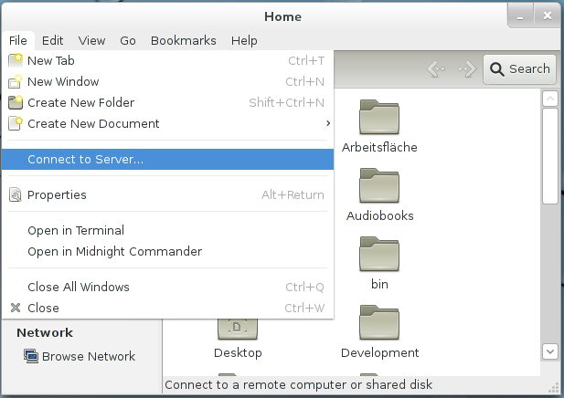
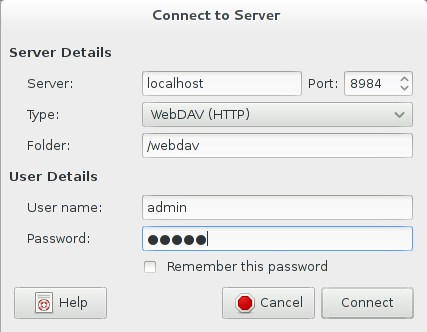
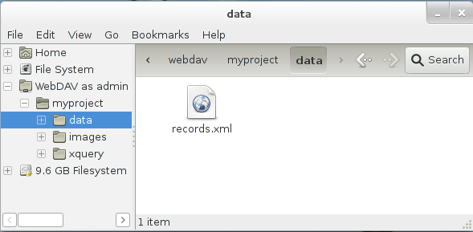

 

 
This page belongs to the [WebDAV](WebDAV.md) page. It describes how to get the WebDAV API running with GNOME and Nautilus. 

  * In Nautilus choose File -> Connect to Server: 
 

  * Choose "WebDAV (HTTP)" from the "Type" drop-down and enter the server address, port and user credentials: 
 

  * After clicking "Connect" the databases can be browsed: 
 

