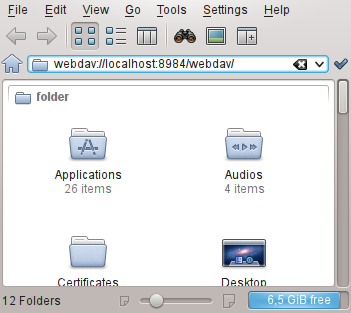
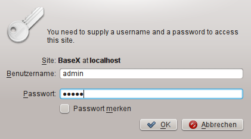
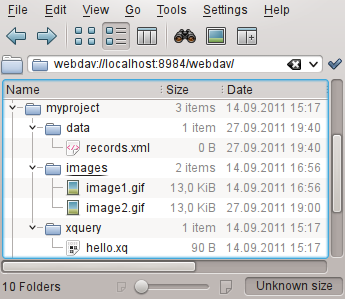

 

 
This page belongs to the [WebDAV](WebDAV.md) page. It describes how to get the WebDAV API running with KDE. 

  * KDE SC provides two file managers - Dolphin and Konqueror, which both support WebDAV using the "webdav://" URL prefix. Start Dolphin or Konqueror and enter the BaseX WebDAV URL (eg. webdav://localhost:8984/webdav): 
 

  * Enter the user credentials: 
 

  * After clicking "OK" the databases can be browsed: 
 

