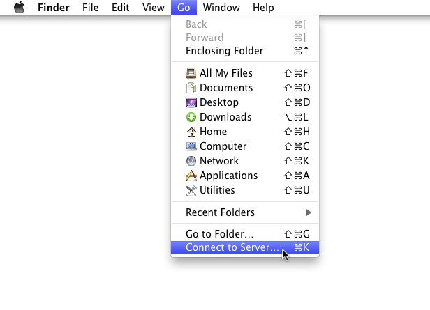
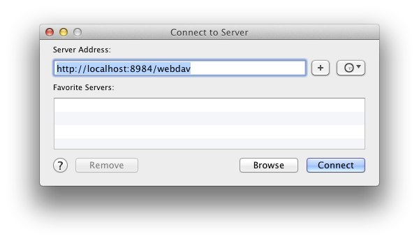
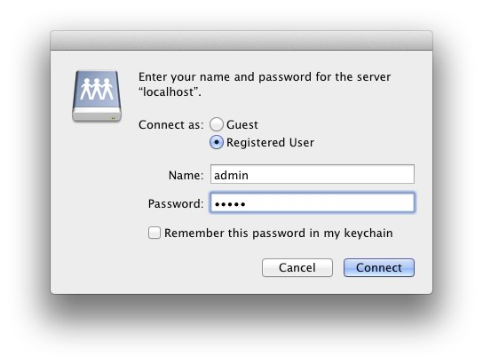
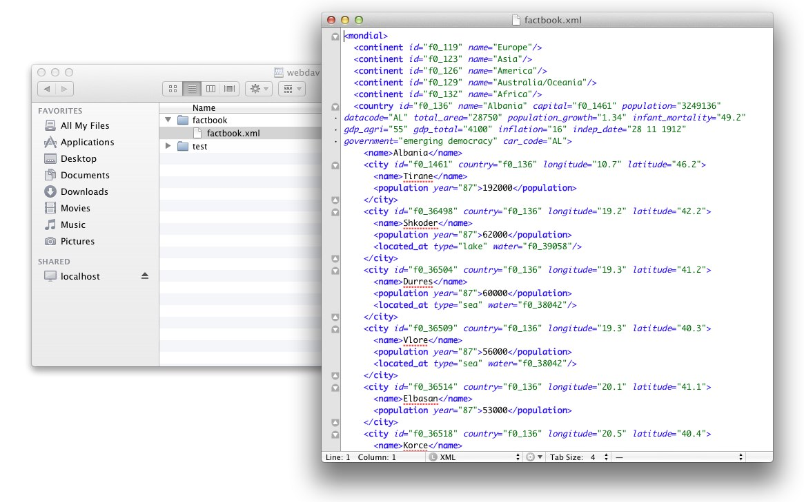

# WebDAV: Mac OSX
 

 
This page belongs to the [WebDAV](WebDAV.md) page. It describes how to get the WebDAV API running with Mac OS X 10.4+. 

  * Mac OS X supports WebDAV since 10.4/Tiger 
 * Open Finder, choose Go -> Connect to Server: 
 

  * Enter BaseX WebDAV URL (eg. [http://localhost:8984/webdav](http://localhost:8984/webdav)) - do not use webdav://-scheme! Press Connect: 
 

  * Enter the user credentials: 
 

  * That's it, now the databases can be browsed: 
 

