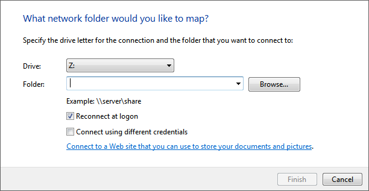
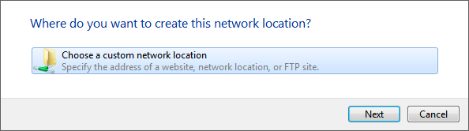
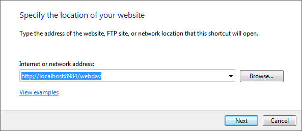
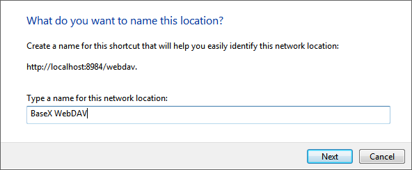
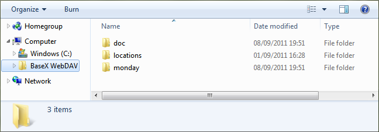

 

 
This page belongs to the [WebDAV](WebDAV.md) page. It describes how to get the WebDAV API running with Windows 7. 

  * Open the Explorer 
 * Open the "Map network drive..." dialog by right-clicking on "My Computer"
 * Click on the link "Connect to a Web site that you can use to store your documents and pictures."
 

  * Click "Next", select "Choose a custom network location" and click "Next" again. 
 

  * Enter the URL address of the BaseX WebDAV Server (e.g. `http://localhost:8984/webdav`) and click "Next". 
 
 If a message saying that the folder is not valid, this is because Microsoft WebClient is not configured to use Baseic HTTP authentication. Please check [this Microsoft article](http://support.microsoft.com/kb/928692/en) in order to enable Basic HTTP authentication. 

  * Enter a name for the network location and click "Next". 
 

  * The BaseX WebDAV can be accessed from the Explorer window. 
 

