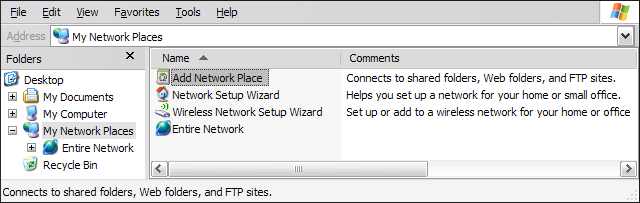
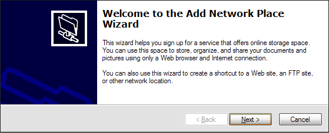
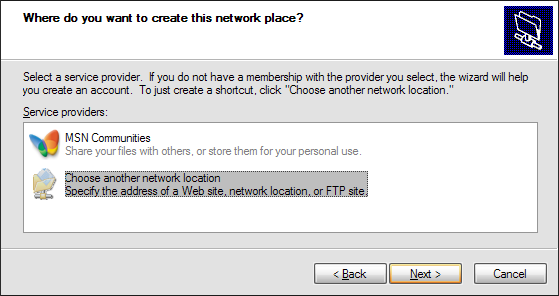
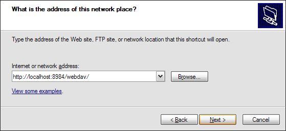
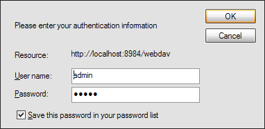
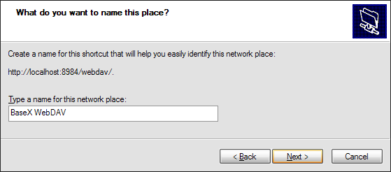
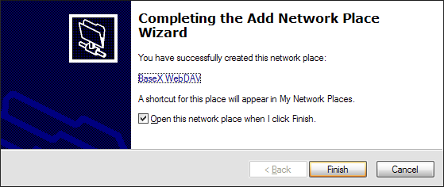
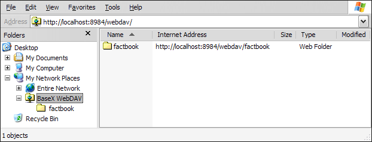

 

 
This page belongs to the [WebDAV](WebDAV.md) page. It describes how to get the WebDAV API running with Windows XP. 

  * In the "My Network Places" view, double click on "Add Network Place": 
 

  * Confirm the upcoming introductory dialog: 
 

  * Select "Choose another network location" in the next dialog: 
 

  * Next, specify the BaseX WebDAV URL: 
 

  * Enter the user/password combination to connect to the WebDAV service: 
 

  * Assign a name to your WebDAV connection: 
 

  * Finish the wizard: 
 

  * You can now see all BaseX databases in the Windows Explorer: 
 

