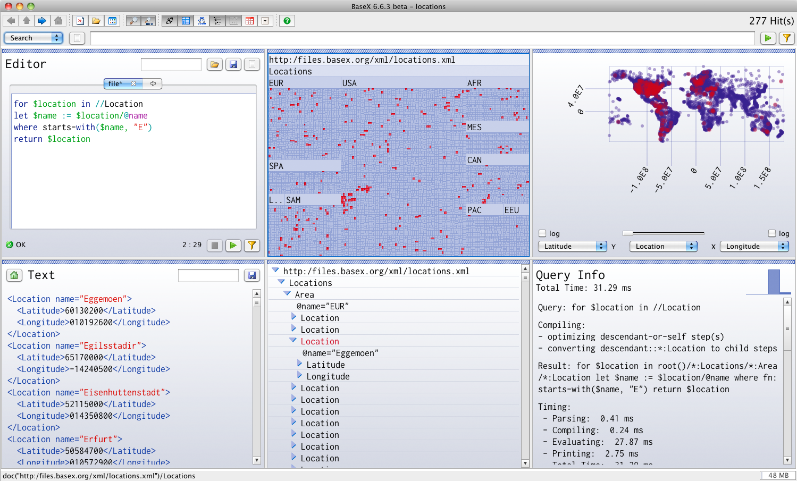

# Main Page
 

!!! warning
    Some note

!!! note
    Some note

 

 
BaseX GUI
# Welcome to the documentation of BaseX!
[BaseX](http://basex.org) is both a light-weight, high-performance and scalable XML Database and an XQuery 3.0 Processor with full support for the W3C Update and Full Text extensions. It focuses on storing, querying, and visualizing large XML and JSON documents and collections. A visual frontend allows users to interactively explore data and evaluate queries in realtime (i.e., with each key click). BaseX is platform-independent and distributed under the free BSD License (find more in [Wikipedia](http://en.wikipedia.org/wiki/BaseX)). 

 
This documentation is based on **BaseX 8.0**. It can also be downloaded as [PDF](Documentation.md). Features that have recently been added or changed are highlighted and can be [searched for](http://docs.basex.org/index.php?search=7.8). 

 
## [Getting Started](Getting Started.md)

The [Getting Started](Getting Started.md) Section gives you a quick introduction to BaseX. We suggest you to start with the [Graphical User Interface](Graphical User Interface.md) as this is the easiest way to access your XML data, and to get an idea of how XQuery and BaseX works. 

Categories: [Beginners](http://docs.basex.org/wiki/Category:Beginner)

 
## [XQuery Portal](XQuery.md)

More information on using the wide range of XQuery functions and performing XPath and XQuery requests with BaseX can be found in our [XQuery Portal](XQuery.md). 

Categories: [XQuery](http://docs.basex.org/wiki/Category:XQuery)

  
## [Developer Section](Developing.md)

 The [Developer Section](Developing.md) provides useful information for developers. Here you can find information on our supported client APIs and HTTP services, and we present different ways how you can integrate BaseX into your own project. 

Categories: [Developer](http://docs.basex.org/wiki/Category:Developer), [HTTP](http://docs.basex.org/wiki/Category:HTTP), [API](http://docs.basex.org/wiki/Category:API)

 
## [Advanced User's Guide](Advanced User's Guide.md)

Information for advanced users can be found in our [Advanced User's Guide](Advanced User's Guide.md), which contains details on the BaseX storage, the Client/Server architecture, and some querying features. 

Categories: [Internals](http://docs.basex.org/wiki/Category:Internals)

 You are invited to contribute to our Wiki: it's easy to [get a new account](http://docs.basex.org/wiki/Special:UserLogin).If you have questions and are looking for direct contact to developers and users, please write to our [basex-talk](http://basex.org/open-source/) mailing list. 

